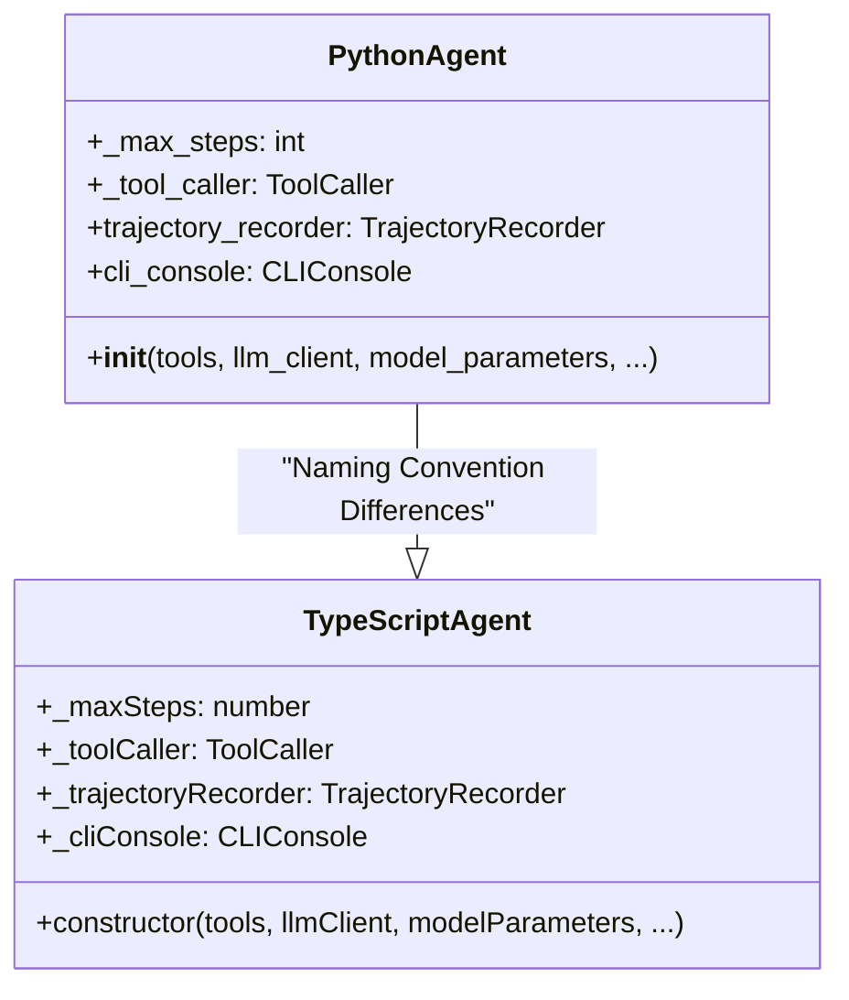
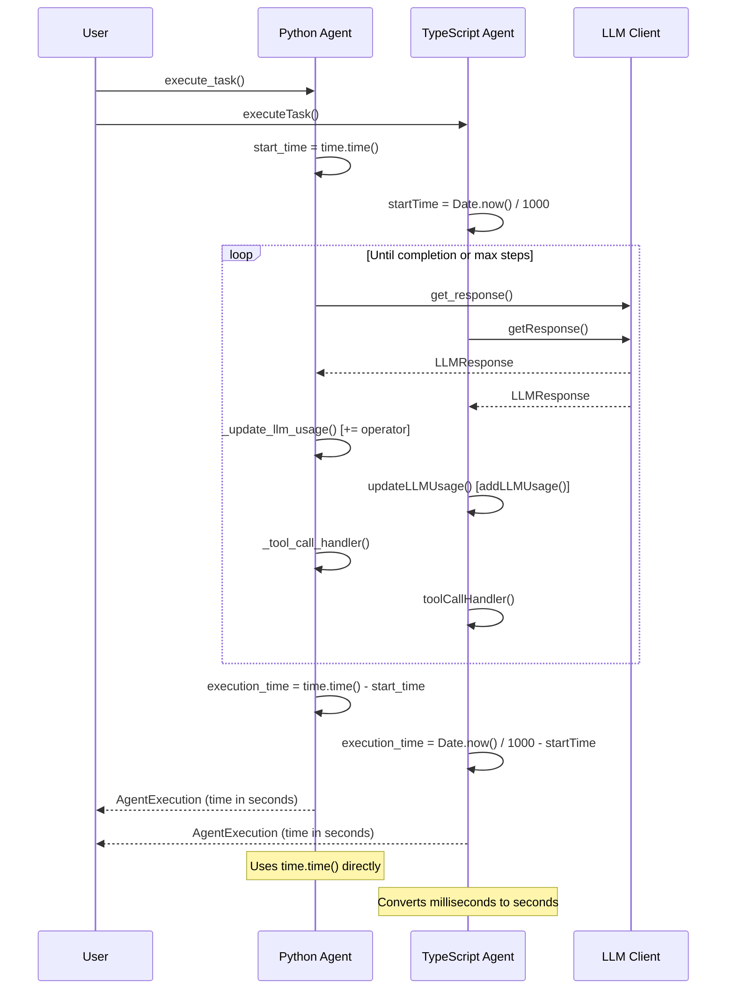
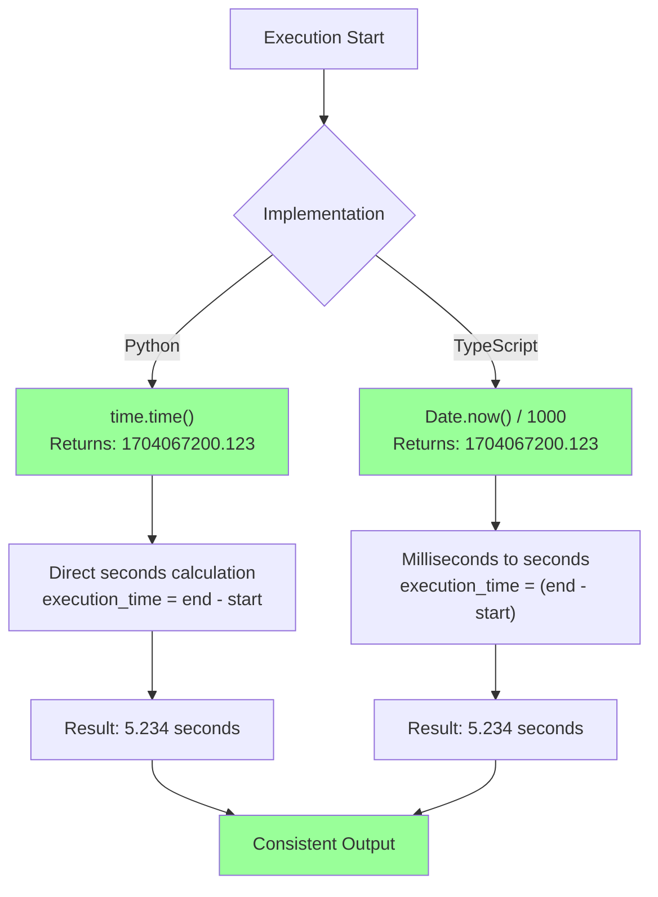
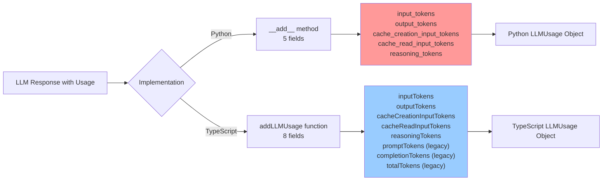
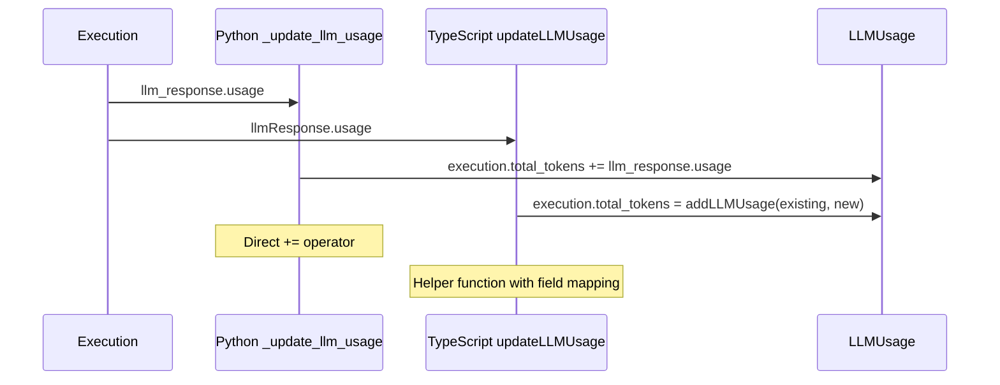
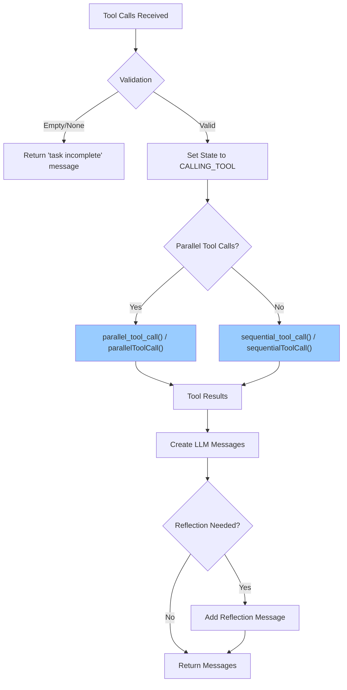
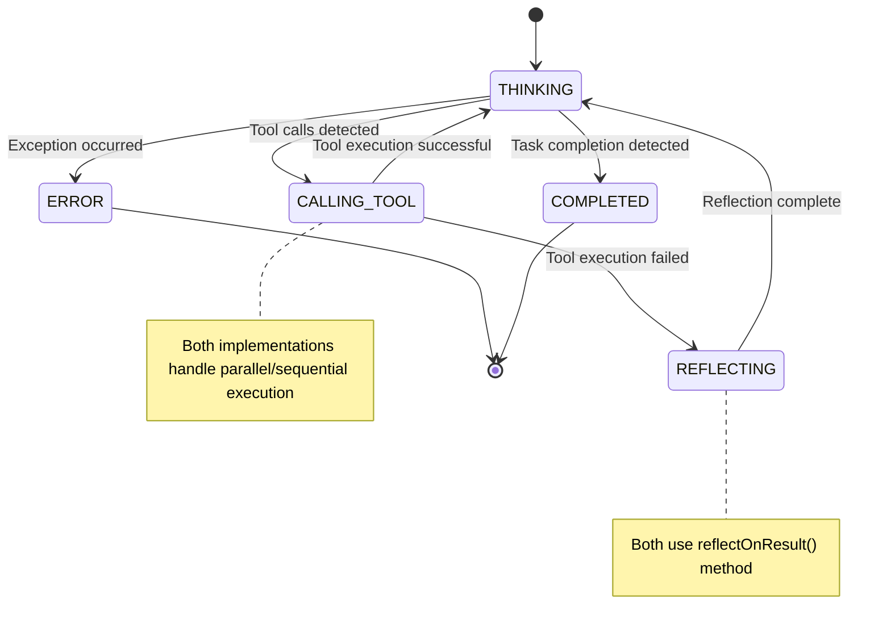
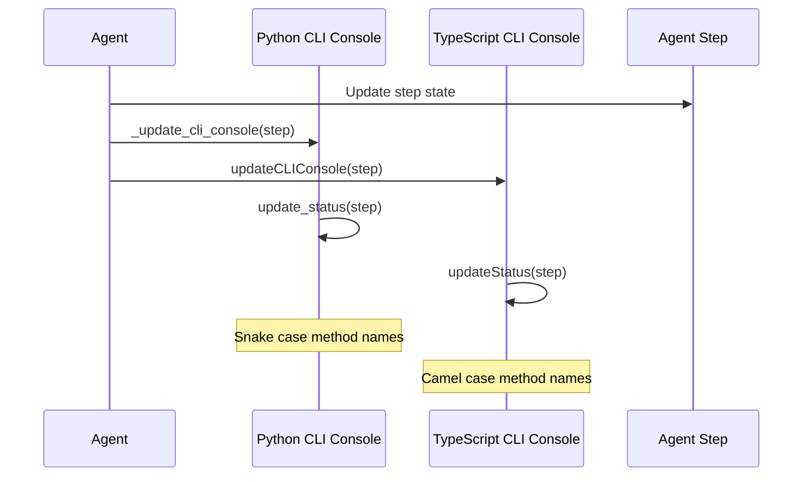
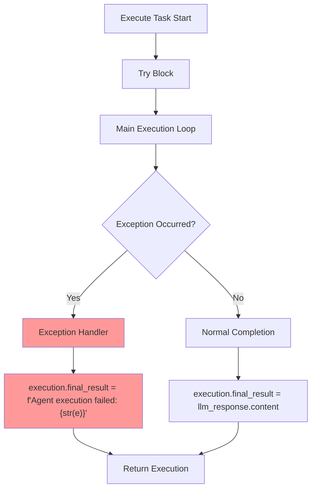

# Agent Base Class Detailed Comparison

This document provides an in-depth comparison of the agent base classes between TypeScript and Python implementations.

## File Mapping
- **Python**: `trae_agent/agent/base.py`
- **TypeScript**: `trae_agent/agent/base.ts`

## 1. Class Structure and Initialization

### 1.1 Constructor Differences



**Key Differences**:
- Field naming: `_max_steps` vs `_maxSteps`
- Parameter naming: `llm_client` vs `llmClient`
- Access modifiers: Python uses public fields, TypeScript uses private fields

## 2. Execution Flow Comparison

### 2.1 Main Execution Loop



### 2.2 Critical Time Measurement Issue



**Status**: ✅ **RESOLVED** - Both implementations now report time in seconds correctly.

## 3. Token Usage Handling

### 3.1 Token Accumulation Differences



### 3.2 Token Usage Update Methods



**Key Differences**:
- **Python**: Uses `+=` operator with dataclass `__add__` method
- **TypeScript**: Uses `addLLMUsage()` helper function
- **Field Count**: Python tracks 5 fields, TypeScript tracks 8 (including legacy)

## 4. Tool Call Handling

### 4.1 Tool Call Handler Flow



### 4.2 Message Construction Differences

```mermaid
classDiagram
    class PythonMessageConstruction {
        +LLMMessage(role="user", tool_result=tool_result)
        +LLMMessage(role="assistant", content=reflection)
    }
    
    class TypeScriptMessageConstruction {
        +{role: 'user', toolResult: toolResult}
        +{role: 'assistant', content: reflection}
    }
    
    PythonMessageConstruction --|> TypeScriptMessageConstruction : "Constructor vs Object Literal"
```

**Key Differences**:
- **Python**: Uses dataclass constructor with named parameters
- **TypeScript**: Uses object literal with camelCase properties
- **Field Naming**: `tool_result` vs `toolResult`

## 5. State Management

### 5.1 Agent State Transitions



### 5.2 CLI Console Updates



## 6. Error Handling Patterns

### 6.1 Exception Handling in Execute Task



**Consistency**: ✅ Both implementations handle exceptions identically

## 7. Reflection and Task Completion

### 7.1 Task Completion Detection

```mermaid
flowchart LR
    A[LLM Response] --> B[llm_indicates_task_completed()]
    B -->|True| C[is_task_completed()]
    B -->|False| D[Check for Tool Calls]
    
    C -->|True| E[