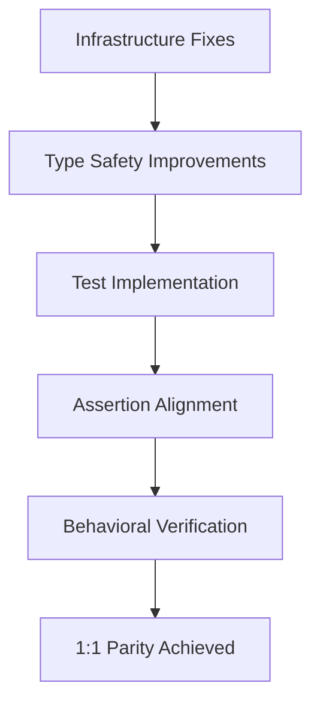

# Trae Agent Critical 1:1 Parity Fixes Specification

## 1. Product Overview

This specification addresses all critical deviations preventing strict 1:1 parity between the TypeScript and Python versions of trae-agent. The goal is to eliminate all functional differences, ensure identical behavior, and achieve complete test coverage alignment while maintaining the TypeScript language adaptations that are acceptable.

## 2. Core Features

### 2.1 Critical Infrastructure Fixes

Our requirements consist of the following main areas:
1. **Core Agent Infrastructure**: Fix token usage accumulation, enum handling, and type safety issues in base.ts, trae_agent.ts, and agent_basics.ts
2. **Test Coverage Alignment**: Implement missing tests and align assertion patterns across all test files
3. **Implementation Consistency**: Standardize return values, error handling, and behavioral patterns
4. **Type Safety Improvements**: Remove `any` types and implement proper TypeScript interfaces

### 2.2 Page Details

| Component | Module | Feature Description |
|-----------|--------|--------------------|
| Core Infrastructure | Token Usage Fix | Implement proper `+=` operator equivalent for LLMUsage accumulation in base.ts |
| Core Infrastructure | Enum Handling | Fix enum value access to use `.value` property consistently with Python |
| Core Infrastructure | Type Safety | Replace `any` types with proper interfaces, especially for llmClient parameter |
| Core Infrastructure | Method Alignment | Remove extra TypeScript methods not present in Python (setTrajectoryRecorder) |
| Test Coverage | TraeAgent Tests | Implement missing 9 out of 11 tests from Python version |
| Test Coverage | EditTool Tests | Add missing create, insert, and view operation tests |
| Test Coverage | Config Tests | Align test focus from base URLs to general configuration testing |
| Test Coverage | Assertion Patterns | Standardize property names and error message expectations |
| Implementation | Return Value Consistency | Ensure all tool methods return identical structures to Python |
| Implementation | Error Handling | Align error messages and exception types with Python version |
| Implementation | String Representation | Add toString() methods equivalent to Python's __repr__ |
| Implementation | File Operations | Standardize line ending handling and directory creation behavior |

## 3. Core Process

### 3.1 Infrastructure Fix Flow
1. **Base Agent Class**: Fix token accumulation using proper addition logic → Fix enum value handling → Remove extra methods
2. **Main Agent Class**: Replace any types with proper interfaces → Align configuration handling → Standardize line processing
3. **Agent Basics**: Add string representation methods → Align error handling → Fix data structure consistency

### 3.2 Test Alignment Flow
1. **Analyze Python Tests**: Extract exact test scenarios and expected outcomes
2. **Implement Missing Tests**: Create TypeScript equivalents with identical assertions
3. **Standardize Patterns**: Align property names, error messages, and return value expectations
4. **Verify Coverage**: Ensure all Python test scenarios are covered

## 4. User Interface Design

### 4.1 Design Style
- **Error Messages**: Maintain exact Python error message formats and content
- **Console Output**: Preserve Python's rich console formatting patterns using TypeScript equivalents
- **Debug Information**: Implement toString() methods that match Python's __repr__ output
- **Test Output**: Align test result formatting with Python unittest patterns
- **Type Annotations**: Use explicit TypeScript interfaces instead of any types

### 4.2 Implementation Design Overview

| Component | Module | Implementation Requirements |
|-----------|--------|----------------------------|
| Base Agent | Token Usage | Implement manual field addition: `total_tokens: (a.total_tokens || 0) + (b.total_tokens || 0)` |
| Base Agent | Enum Access | Use `step.state.value` instead of `step.state` for enum values |
| Main Agent | Type Safety | Define `LLMClientInterface` and replace `any` with proper typing |
| Agent Basics | String Repr | Add `toString()` methods returning debug information like Python's `__repr__` |
| Test Files | Assertion Patterns | Use consistent property names: `error_code`, `success`, `output` |
| Test Files | Coverage Gaps | Implement all missing test scenarios from Python versions |

### 4.3 Responsiveness
The fixes must maintain cross-platform compatibility while ensuring identical behavior on all supported operating systems (Windows, macOS, Linux).

## 5. Critical Fix Requirements

### 5.1 Infrastructure Priority Fixes

**High Priority (Blocking 1:1 Parity)**:
1. **Token Usage Accumulation** in `base.ts`:
   - Current: Uses manual field addition
   - Required: Implement proper `+=` operator equivalent
   - Impact: Incorrect token counting affects usage tracking

2. **Enum Value Handling** in `base.ts`:
   - Current: Passes `step.state` directly
   - Required: Use `step.state.value` like Python
   - Impact: Enum serialization differs from Python

3. **Type Safety** in `trae_agent.ts`:
   - Current: Uses `any` for `llmClient` parameter
   - Required: Define proper `LLMClientInterface`
   - Impact: Breaks TypeScript type safety guarantees

### 5.2 Test Coverage Priority Fixes

**Critical Missing Tests**:
1. **TraeAgent Tests**: 9 out of 11 tests missing
   - Missing: Error handling, configuration, execution flow tests
   - Required: Implement exact Python test scenarios

2. **EditTool Tests**: Missing core functionality tests
   - Missing: `create`, `insert`, `view` operation tests
   - Current: Only tests `replace` operation
   - Required: Full operation coverage like Python

3. **Config Tests**: Completely different focus
   - Current: Tests base URL functionality
   - Required: General configuration testing like Python

### 5.3 Implementation Consistency Fixes

**Return Value Standardization**:
- All tools must return identical property names to Python
- Error codes must match Python conventions
- Success/failure indicators must be consistent

**String Representation**:
- Add `toString()` methods equivalent to Python's `__repr__`
- Ensure debug output matches Python format
- Maintain consistent error message formatting

## 6. Acceptance Criteria

### 6.1 Infrastructure Compliance
- [ ] Token usage accumulation matches Python's `+=` behavior exactly
- [ ] Enum values are accessed using `.value` property consistently
- [ ] All `any` types replaced with proper TypeScript interfaces
- [ ] No extra methods exist in TypeScript that aren't in Python
- [ ] String representation methods provide equivalent debug information

### 6.2 Test Parity Compliance
- [ ] All Python test scenarios implemented in TypeScript
- [ ] Test assertions use identical property names and expectations
- [ ] Error message testing matches Python patterns exactly
- [ ] Test coverage percentages align between versions
- [ ] All test files focus on same functionality as Python equivalents

### 6.3 Behavioral Compliance
- [ ] All tool operations return identical structures to Python
- [ ] Error handling produces same error types and messages
- [ ] File operations handle line endings and directories identically
- [ ] Configuration loading and validation behaves exactly like Python
- [ ] LLM client interactions produce identical request/response patterns

### 6.4 Verification Requirements
- [ ] Side-by-side execution produces identical outputs
- [ ] All edge cases handled consistently between versions
- [ ] Performance characteristics remain comparable
- [ ] Cross-platform behavior is identical
- [ ] No functional regressions introduced during fixes