# Trae Agent Features Guide

This document provides a comprehensive overview of Trae Agent's features, configuration options, and usage patterns.

## Table of Contents

1. [Core Features](#core-features)
2. [Configuration Options](#configuration-options)
3. [Advanced Features](#advanced-features)
4. [Tool System](#tool-system)
5. [LLM Provider Support](#llm-provider-support)
6. [CLI Usage](#cli-usage)
7. [Best Practices](#best-practices)

## Core Features

### Agent Execution

Trae Agent provides intelligent task execution through:

- **Step-by-step breakdown**: Complex tasks are automatically decomposed into manageable steps
- **Tool integration**: Seamless integration with various tools for file editing, command execution, and more
- **Error handling**: Robust error recovery and retry mechanisms
- **State management**: Comprehensive tracking of execution state and progress

### Task Management

The agent handles tasks through:

- **Single task execution**: Focus on one primary objective at a time
- **Sequential thinking**: Structured problem-solving approach
- **Completion detection**: Automatic recognition when tasks are finished
- **Progress tracking**: Real-time monitoring of execution steps

## Configuration Options

### Core Settings (`trae_config.json`)

```json
{
  "default_provider": "anthropic",
  "max_steps": 50,
  "enable_lakeview": true,
  "lakeview_config": {
    "model_provider": "anthropic",
    "model_name": "claude-sonnet-4-20250514"
  },
  "model_providers": {
    "anthropic": {
      "model": "claude-3-5-sonnet-20241022",
      "api_key": "your-api-key",
      "base_url": "https://api.anthropic.com",
      "max_tokens": 8192,
      "temperature": 0.1
    }
  }
}
```

#### Key Configuration Parameters

- **`default_provider`**: Primary LLM provider to use
- **`max_steps`**: Maximum number of execution steps (default: 50)
- **`enable_lakeview`**: Enable enhanced step analysis and visualization
- **`model_providers`**: Detailed configuration for each LLM provider

### Model Provider Configuration

Each provider supports:

- **`model`**: Specific model name to use
- **`api_key`**: Authentication key
- **`base_url`**: API endpoint URL
- **`max_tokens`**: Maximum tokens per request
- **`temperature`**: Creativity/randomness setting (0.0-1.0)
- **`timeout`**: Request timeout in seconds
- **`max_retries`**: Number of retry attempts

## Advanced Features

### Lakeview Enhancement

Lakeview provides enhanced visualization and analysis:

- **Step analysis**: Detailed breakdown of each execution step
- **Task classification**: Automatic categorization with emoji tags
- **Progress visualization**: Enhanced CLI display with rich formatting
- **Trajectory insights**: Deep analysis of agent decision-making

**Configuration:**
```json
{
  "enable_lakeview": true,
  "lakeview_config": {
    "model_provider": "anthropic",
    "model_name": "claude-sonnet-4-20250514"
  }
}
```

### Trajectory Recording

Capture detailed execution data for analysis:

- **Complete interaction logs**: All LLM requests and responses
- **Step-by-step tracking**: Detailed execution flow
- **Metadata capture**: Task context and configuration
- **JSON format**: Structured data for analysis

**Usage:**
```bash
trae-agent --trajectory-file execution_log.json "Your task here"
```

## Tool System

### Available Tools

1. **EditTool**: File editing and modification
2. **BashTool**: Command execution and system interaction
3. **JsonEditTool**: JSON file manipulation
4. **SequentialThinkingTool**: Structured problem-solving
5. **TaskDoneTool**: Task completion marking

### Tool Execution Flow

1. **Tool selection**: Agent chooses appropriate tool for the task
2. **Parameter preparation**: Arguments are prepared and validated
3. **Execution**: Tool performs the requested operation
4. **Result processing**: Output is analyzed and integrated
5. **Next step planning**: Agent determines subsequent actions

## LLM Provider Support

### Supported Providers

- **Anthropic**: Claude models (Sonnet, Haiku, Opus)
- **OpenAI**: GPT-4, GPT-3.5, and other models
- **Google**: Gemini and PaLM models
- **Azure**: Azure OpenAI Service
- **Ollama**: Local model hosting
- **OpenRouter**: Multi-provider access
- **Doubao**: ByteDance's LLM service

### Provider-Specific Features

- **Retry mechanisms**: Automatic retry on failures
- **Rate limiting**: Respect API rate limits
- **Error handling**: Provider-specific error recovery
- **Model switching**: Fallback to alternative models

## CLI Usage

### Basic Commands

```bash
# Execute a task
trae-agent "Create a Python script that processes CSV files"

# Use specific provider
trae-agent --provider openai "Your task"

# Enable verbose output
trae-agent --verbose "Your task"

# Record trajectory
trae-agent --trajectory-file log.json "Your task"

# Set maximum steps
trae-agent --max-steps 30 "Your task"
```

### Advanced Options

- **`--provider`**: Override default LLM provider
- **`--verbose`**: Enable detailed logging
- **`--trajectory-file`**: Save execution trajectory
- **`--max-steps`**: Limit execution steps
- **`--config`**: Use custom configuration file

## Best Practices

### Task Definition

1. **Be specific**: Clearly define the desired outcome
2. **Provide context**: Include relevant background information
3. **Set constraints**: Specify any limitations or requirements
4. **Break down complex tasks**: For very large tasks, consider splitting them

### Configuration Management

1. **Use environment variables**: Store API keys securely
2. **Version control**: Track configuration changes
3. **Provider fallbacks**: Configure multiple providers for reliability
4. **Monitor usage**: Track API consumption and costs

### Performance Optimization

1. **Choose appropriate models**: Balance capability with cost
2. **Set reasonable limits**: Use `max_steps` to prevent runaway execution
3. **Enable Lakeview**: For better visibility into agent behavior
4. **Use trajectory recording**: For debugging and optimization

### Error Handling

1. **Check logs**: Review execution logs for issues
2. **Verify configuration**: Ensure API keys and settings are correct
3. **Test with simple tasks**: Validate setup with basic operations
4. **Monitor rate limits**: Avoid exceeding provider limits

## Troubleshooting

### Common Issues

1. **API key errors**: Verify credentials in configuration
2. **Rate limiting**: Implement delays or use different providers
3. **Model availability**: Check if specified models are accessible
4. **Network issues**: Verify connectivity to provider APIs

### Debug Mode

Enable verbose logging for detailed troubleshooting:

```bash
trae-agent --verbose "Your task"
```

### Configuration Validation

Ensure your `trae_config.json` is properly formatted and contains all required fields.

## Detailed Architecture Diagrams

### Agent Execution Flow with Tool Calls

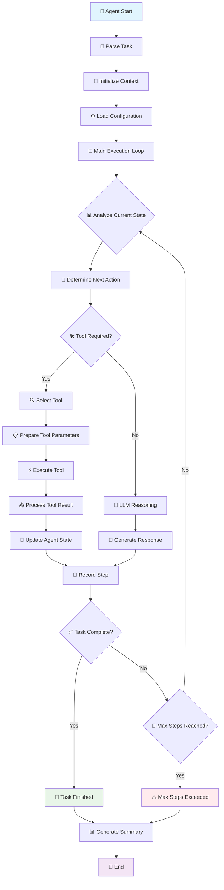

### Deep Tool Call Architecture

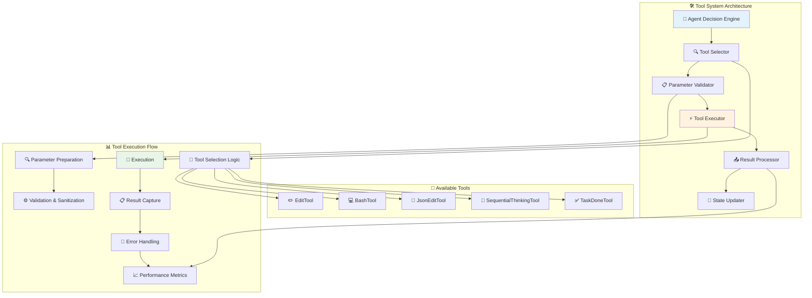

### LLM Client Interaction Flow

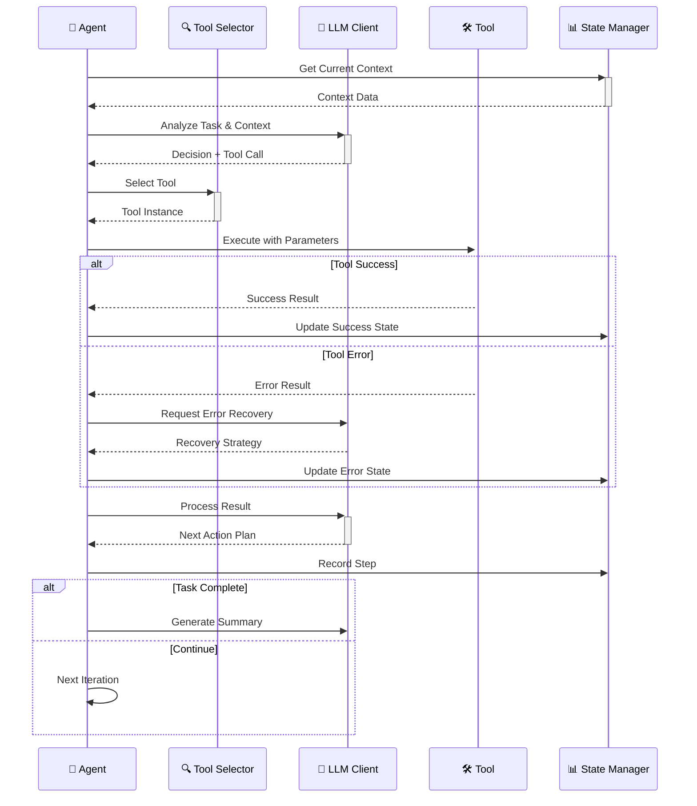

### Tool Parameter Flow

```mermaid
flowchart LR
    subgraph "📥 Input Processing"
        A["🎯 Agent Intent"] --> B["🔍 Tool Selection"]
        B --> C["📋 Parameter Extraction"]
    end
    
    subgraph "🔧 Parameter Preparation"
        C --> D["🧹 Data Sanitization"]
        D --> E["✅ Type Validation"]
        E --> F["🔒 Security Check"]
        F --> G["📏 Constraint Validation"]
    end
    
    subgraph "⚡ Execution Phase"
        G --> H["🚀 Tool Invocation"]
        H --> I["📊 Progress Monitoring"]
        I --> J["⏱️ Timeout Handling"]
    end
    
    subgraph "📤 Output Processing"
        J --> K["📋 Result Capture"]
        K --> L["🔍 Result Validation"]
        L --> M["📝 State Update"]
        M --> N["📊 Metrics Collection"]
    end
    
    style A fill:#e1f5fe
    style H fill:#fff3e0
    style N fill:#e8f5e8
```

### Error Handling and Recovery

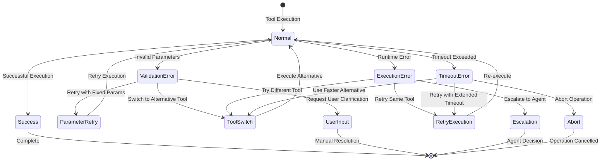

### Lakeview Enhancement Flow

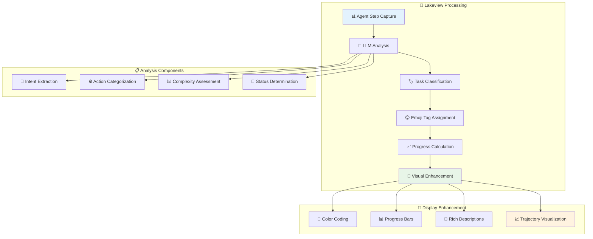

### Configuration and Provider Management

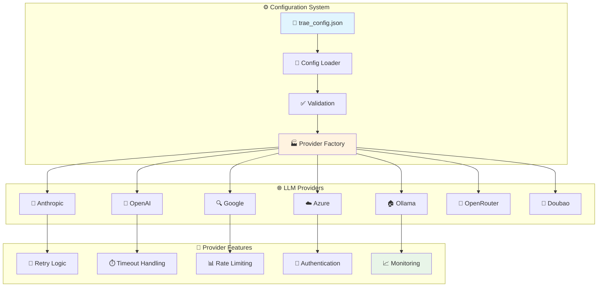

### Trajectory Recording System

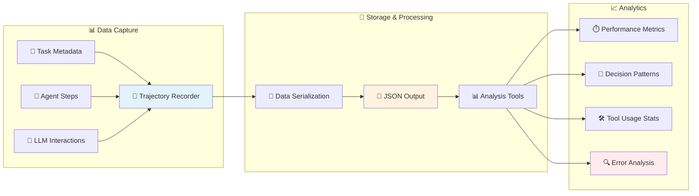

### Complete Agent Loop Architecture

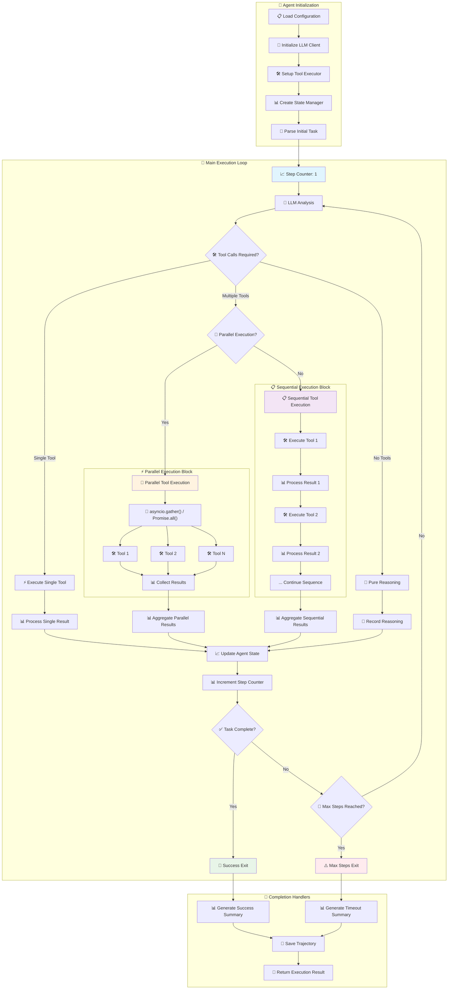

### Parallel Tool Execution Deep Dive

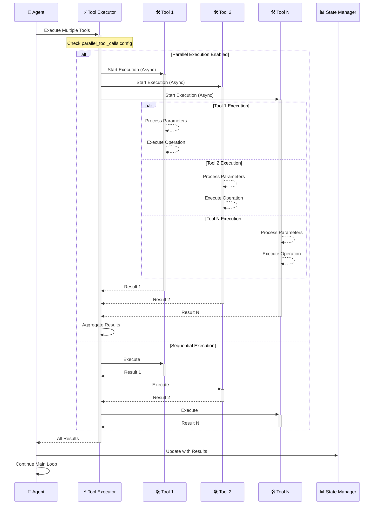

### Agent State and Loop Management

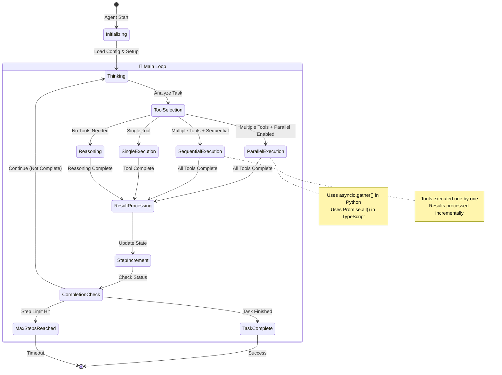

### Tool Execution Patterns and Loops

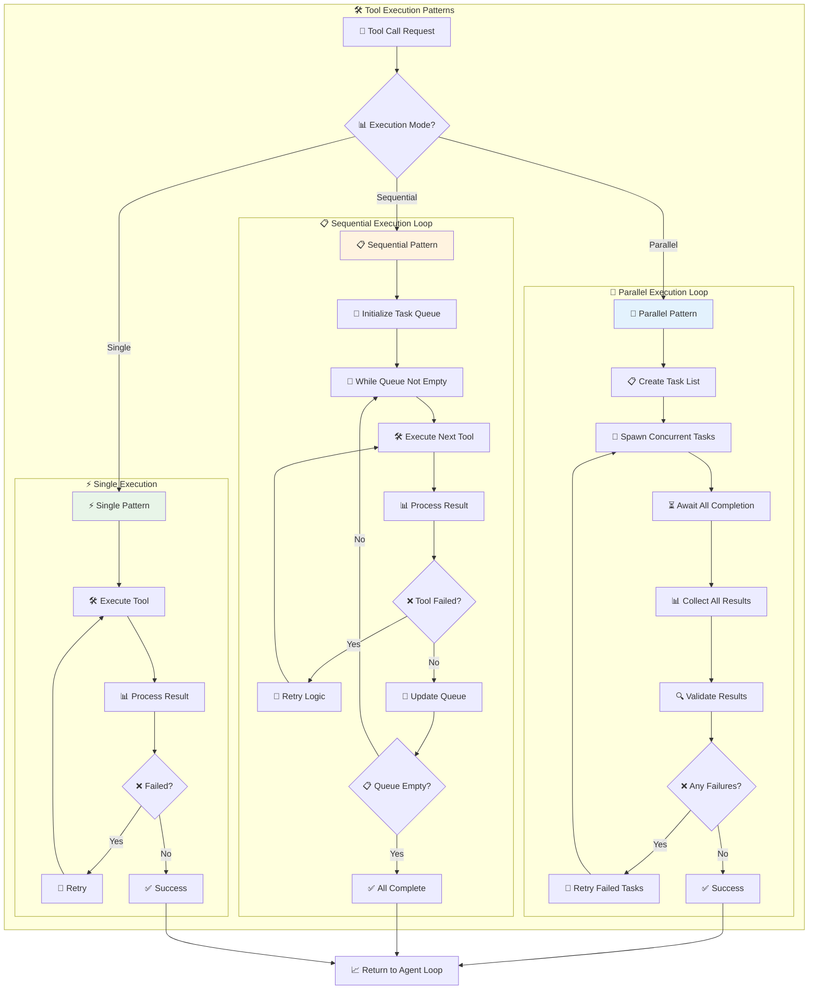

### Sub-Process and External Command Execution

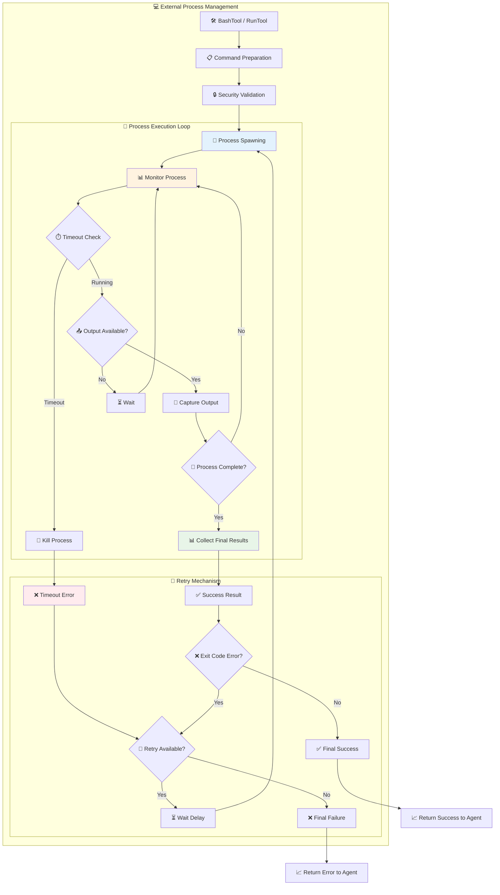

### Detailed State Manager Architecture

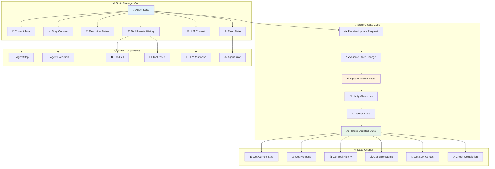

### State Transitions and Lifecycle

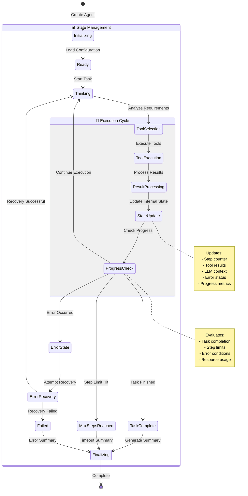

### State Data Flow and Dependencies

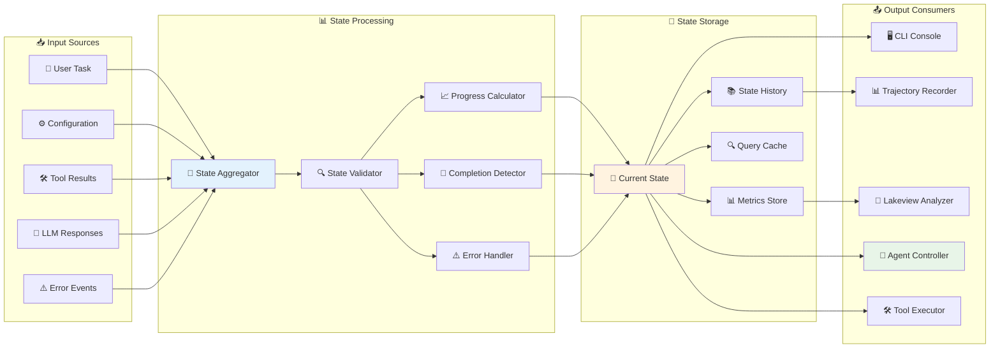

### State Synchronization and Concurrency

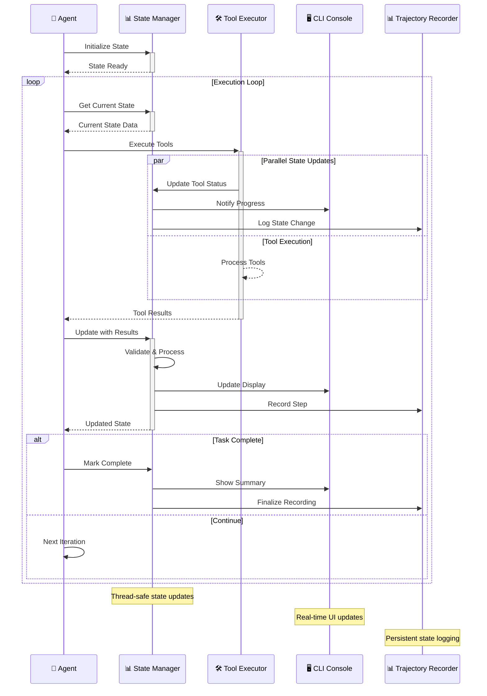

---

*This comprehensive guide covers all loops, agent patterns, parallel execution mechanisms, and sub-process management in Trae Agent. The detailed Mermaid diagrams illustrate the complete architecture including parallel tool execution, sequential processing, state management loops, and external process handling. No sub-agents are spawned - the system uses a single agent with sophisticated tool execution patterns and parallel processing capabilities.*
