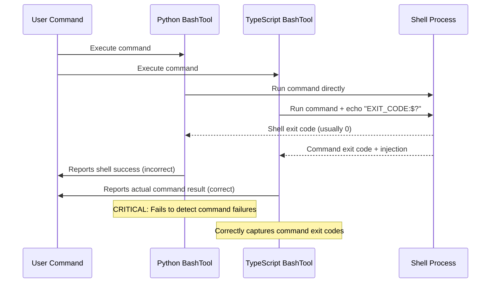
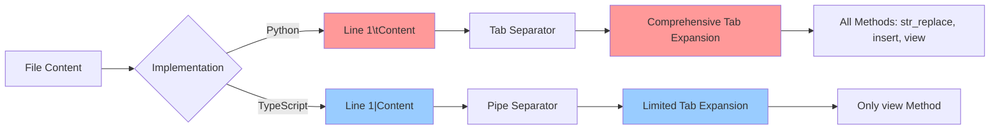
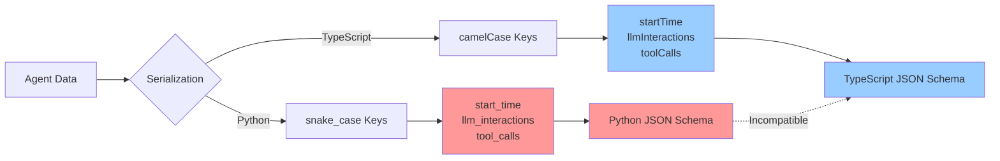
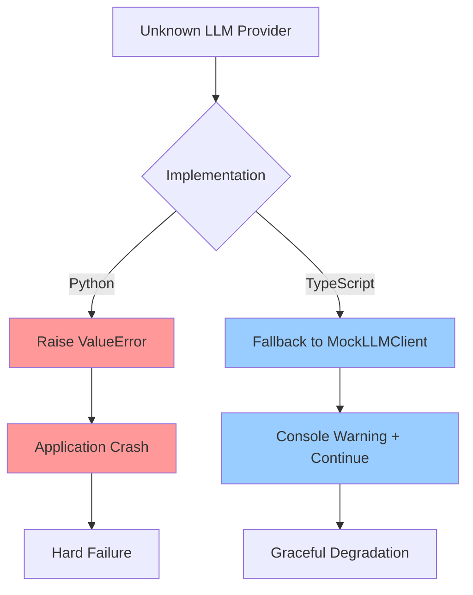
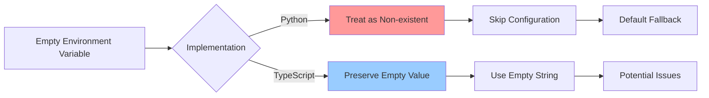
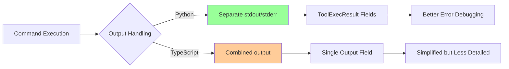
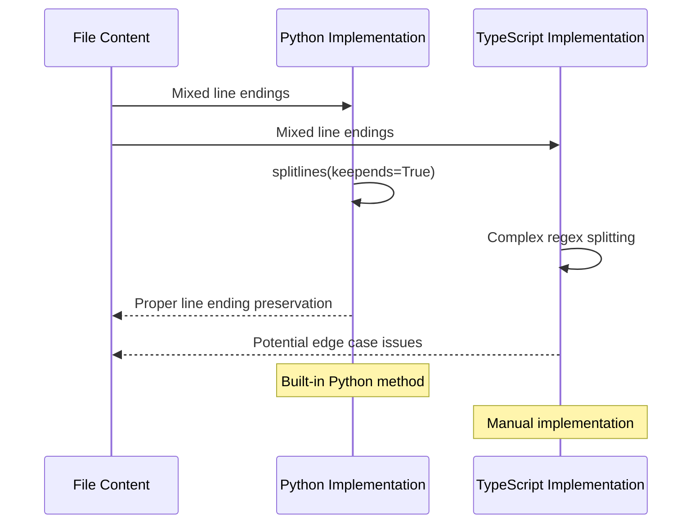
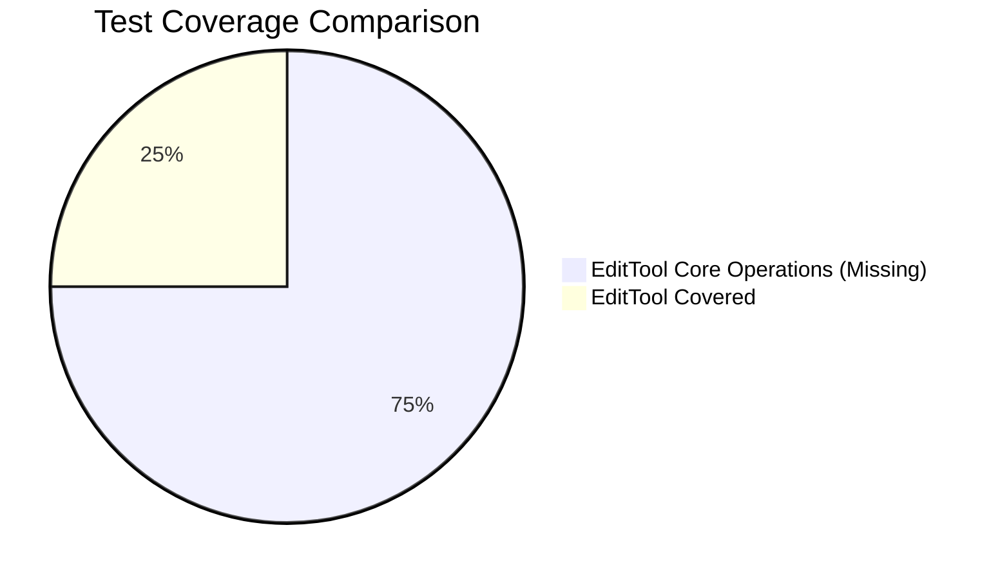
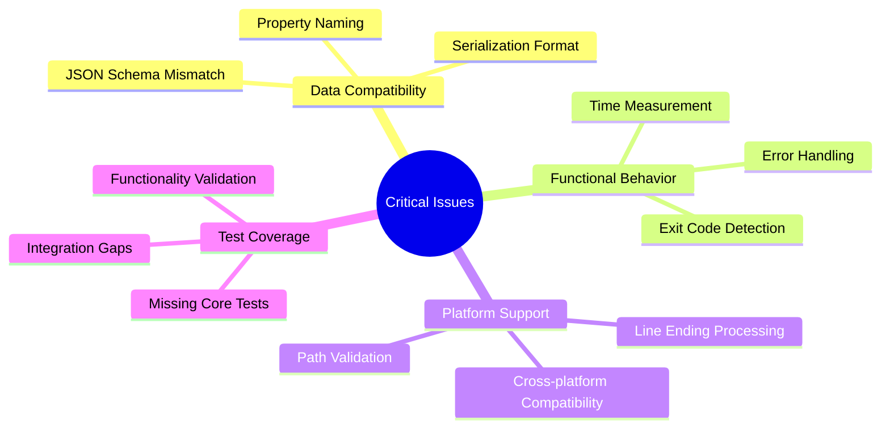

# TypeScript vs Python Functional Comparison

This document provides a comprehensive comparison of the functional and logical flow differences between TypeScript and Python implementations in the Trae Agent codebase.

## Overview

Based on the analysis from the conversion requirements document, this comparison focuses on critical functional deviations that affect the 1:1 port compliance between implementations.

## 1. Agent Base Class Comparison

### Execution Flow Differences

```mermaid
flowchart TD
    A[Agent Execution Start] --> B{Time Measurement}
    B -->|Python| C[time.time() - seconds]
    B -->|TypeScript| D[Date.now() - milliseconds]
    
    C --> E[Token Accumulation]
    D --> F[Token Accumulation]
    
    E -->|Python| G[+= operator with 5 fields]
    F -->|TypeScript| H[addLLMUsage() with 8 fields]
    
    G --> I[Execution Complete]
    H --> I
    
    style C fill:#ff9999
    style D fill:#99ccff
    style G fill:#ff9999
    style H fill:#99ccff
```

### Critical Issues:
- **Time Reporting**: 1000x difference (seconds vs milliseconds)
- **Token Data**: Different field counts and preservation methods

## 2. Tool Implementation Comparisons

### 2.1 Bash Tool - Exit Code Detection



### 2.2 Edit Tool - Line Number Formatting



### 2.3 JSON Edit Tool - JSONPath Handling

```mermaid
flowchart TD
    A[JSONPath Expression] --> B{Implementation}
    B -->|Python| C[jsonpath_ng Library]
    B -->|TypeScript| D[jsonpath-plus + Manual Regex]
    
    C --> E[Full JSONPath Specification]
    D --> F[Basic Patterns Only]
    
    E --> G[Complex Expressions Supported]
    F --> H[Complex Expressions Fail]
    
    G --> I[Cross-platform Path Validation]
    H --> J[Unix/Linux Only]
    
    I --> K[Path.is_absolute()]
    J --> L[startsWith('/')]
    
    style C fill:#99ff99
    style D fill:#ff9999
    style G fill:#99ff99
    style H fill:#ff9999
    style K fill:#99ff99
    style L fill:#ff9999
```

## 3. Data Format Incompatibilities

### 3.1 Trajectory Recorder JSON Schema



### 3.2 Agent Basics Serialization

```mermaid
classDiagram
    class PythonAgentStep {
        +step_number: int
        +tool_calls: list
        +final_result: str
        +llm_response: LLMResponse
    }
    
    class TypeScriptAgentStep {
        +stepNumber: number
        +toolCalls: array
        +finalResult: string
        +llmResponse: LLMResponse
    }
    
    PythonAgentStep -.->|Incompatible| TypeScriptAgentStep
    
    note for PythonAgentStep "snake_case properties"
    note for TypeScriptAgentStep "camelCase properties"
```

## 4. Error Handling Patterns

### 4.1 LLM Client Provider Handling



### 4.2 Configuration Error Handling



## 5. Performance and Output Handling

### 5.1 Edit Tool Output Management

```mermaid
flowchart TD
    A[Large File Operation] --> B{Implementation}
    B -->|Python| C[maybe_truncate() Method]
    B -->|TypeScript| D[No Truncation]
    
    C --> E[Controlled Output Size]
    D --> F[Unlimited Output]
    
    E --> G[Console Performance Maintained]
    F --> H[Potential Performance Issues]
    
    style C fill:#99ff99
    style D fill:#ff9999
    style G fill:#99ff99
    style H fill:#ff9999
```

### 5.2 Bash Tool Output Format



## 6. Line Ending and Text Processing

### 6.1 Trae Agent Line Processing



## 7. Test Coverage Gaps

### 7.1 Critical Missing Tests in TypeScript

```mermaid
gantt
    title Test Implementation Status
    dateFormat X
    axisFormat %s
    
    section Python Tests
    TraeAgent Tests    :done, py-trae, 0, 11
    BashTool Tests     :done, py-bash, 0, 5
    EditTool Tests     :done, py-edit, 0, 9
    JSONEditTool Tests :done, py-json, 0, 8
    Config Tests       :done, py-config, 0, 7
    
    section TypeScript Tests
    TraeAgent Tests    :done, ts-trae, 0, 12
    BashTool Tests     :done, ts-bash, 0, 14
    EditTool Tests     :crit, ts-edit, 0, 3
    JSONEditTool Tests :done, ts-json, 0, 22
    Config Tests       :done, ts-config, 0, 13
```





## 8. Platform Compatibility Issues

### 8.1 Path Validation Differences

```mermaid
flowchart TD
    A[File Path Input] --> B{Platform}
    B -->|Windows| C["C:\\path\\to\\file"]
    B -->|Unix/Linux| D["/path/to/file"]
    
    C --> E{Implementation}
    D --> E
    
    E -->|Python| F[Path.is_absolute()]
    E -->|TypeScript| G[startsWith('/')]
    
    F --> H[Cross-platform Support]
    G --> I[Unix/Linux Only]
    
    C --> G
    G --> J[Validation Fails on Windows]
    
    style F fill:#99ff99
    style G fill:#ff9999
    style H fill:#99ff99
    style I fill:#ff9999
    style J fill:#ff0000
```

## 9. Summary of Critical Issues

### High Priority Fixes Required



### Impact Assessment

| Issue Category | Impact Level | Cross-Language Compatibility |
|----------------|--------------|------------------------------|
| Data Format Incompatibility | 🔴 Critical | ❌ Broken |
| Exit Code Detection | 🔴 Critical | ❌ Different Behavior |
| Time Measurement | 🟡 High | ⚠️ 1000x Difference |
| Platform Compatibility | 🟡 High | ❌ Windows Unsupported |
| Test Coverage Gaps | 🟡 High | ⚠️ Unvalidated Functionality |
| Output Formatting | 🟢 Medium | ⚠️ Visual Differences |

## 10. Recommendations

### Immediate Actions Required

1. **Standardize JSON Schema**: Align property naming conventions
2. **Fix Exit Code Detection**: Implement proper command result capture in Python
3. **Harmonize Time Measurement**: Use consistent units across implementations
4. **Add Missing Tests**: Implement critical functionality tests in TypeScript
5. **Platform Compatibility**: Fix Windows path validation in TypeScript
6. **Error Handling Alignment**: Standardize error recovery patterns

### Long-term Improvements

1. **Shared Type Definitions**: Create conversion utilities between implementations
2. **Cross-language Testing**: Implement compatibility validation tests
3. **Documentation Standards**: Maintain behavioral specification documents
4. **Automated Compliance Checking**: Build tools to detect implementation drift

This comparison reveals that while the structural mapping is complete, significant functional deviations exist that prevent true 1:1 port compliance and cross-language interoperability.