# Trae Agent Architecture Documentation

This document provides a comprehensive overview of the Trae Agent architecture, including workflow diagrams, component interactions, and system design patterns.

## Overview

Trae Agent is an LLM-based autonomous agent designed for software engineering tasks. It features a modular architecture with support for multiple LLM providers, sophisticated tool execution, trajectory recording, and enhanced visualization through Lakeview.

## Core Components

### 1. Agent Hierarchy

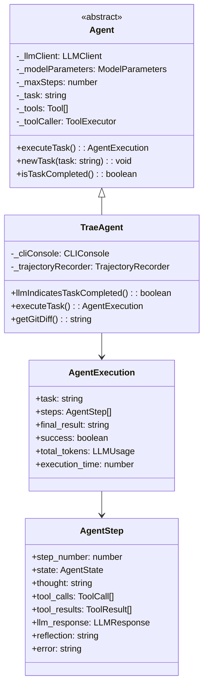

### 2. Tool System Architecture

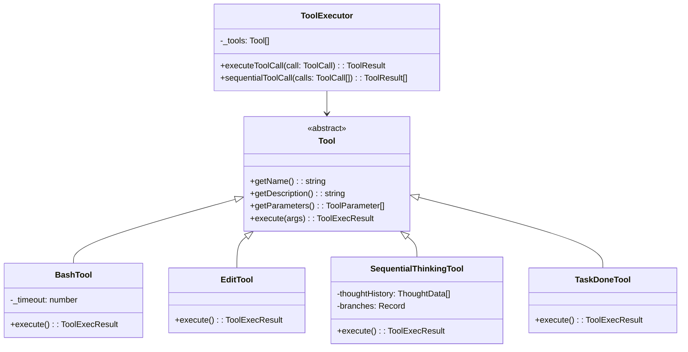

### 3. LLM Client Architecture

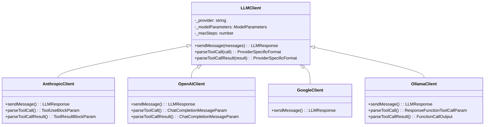

## Agent Execution Flow

### Main Execution Workflow

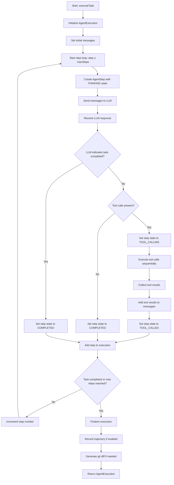

### Tool Execution Flow

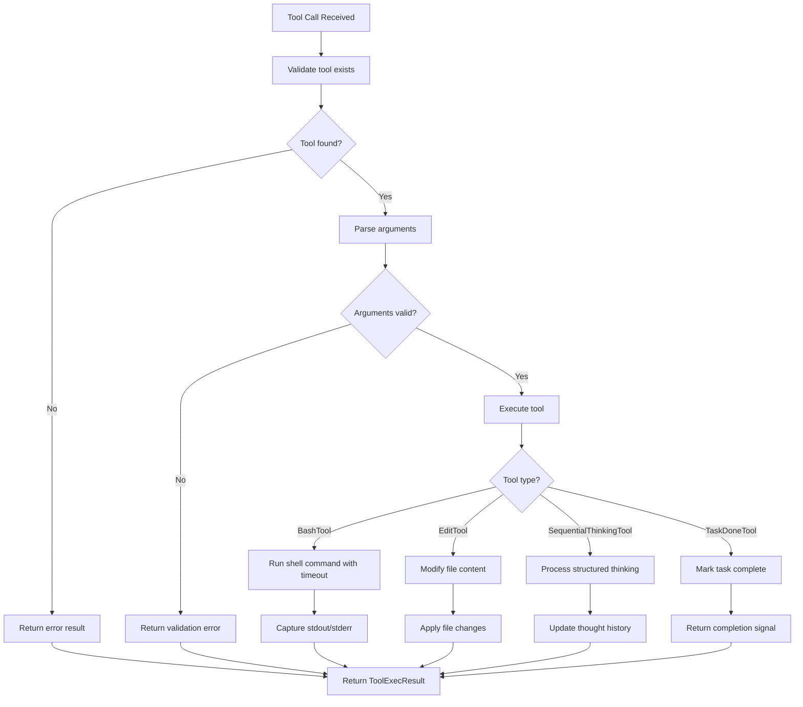

## State Management

### Agent States

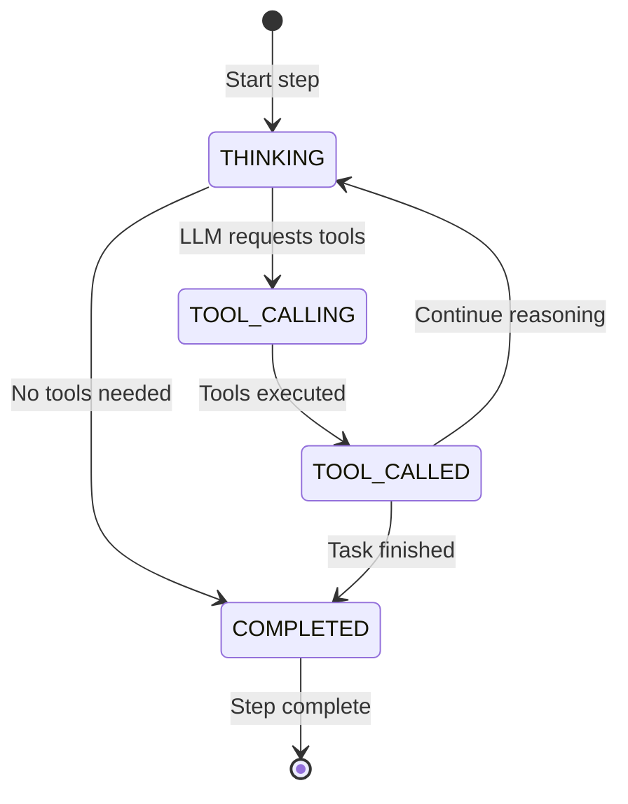

### Configuration Flow

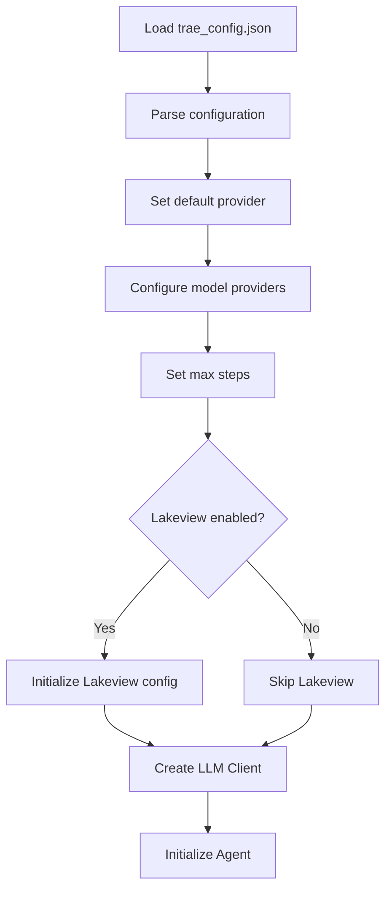

## Advanced Features

### Lakeview Integration

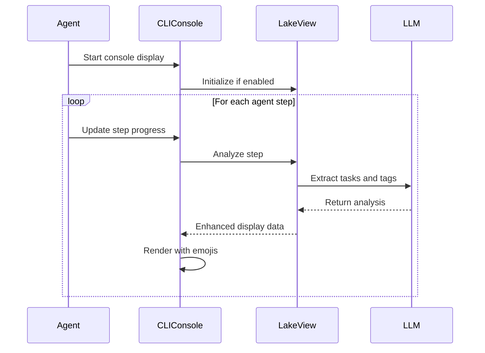

### Trajectory Recording

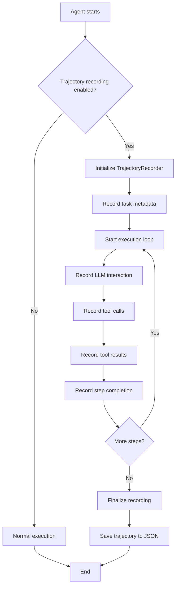

## Task Management

While Trae Agent doesn't have a traditional "todo list" system, it manages tasks through:

1. **Single Task Execution**: Each agent instance handles one primary task
2. **Step-by-Step Breakdown**: Complex tasks are broken down into sequential steps
3. **Tool-Based Subtasks**: Each tool call represents a subtask
4. **Sequential Thinking**: The SequentialThinkingTool helps break down complex problems
5. **Task Completion Detection**: Multiple mechanisms detect when tasks are complete

### Task Lifecycle

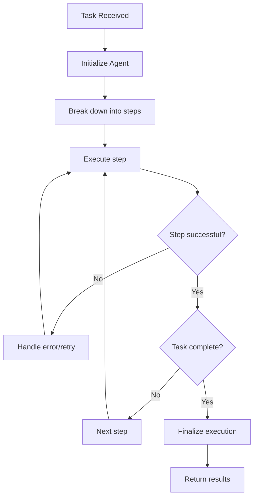

## Configuration Options

The agent supports extensive configuration through `trae_config.json`:

- **Model Providers**: OpenAI, Anthropic, Google, Azure, Ollama, OpenRouter
- **Execution Control**: max_steps, default_provider
- **Enhanced Features**: enable_lakeview, lakeview_config
- **Provider-Specific Settings**: API keys, base URLs, model parameters
- **Runtime Options**: trajectory recording, verbose output

## Error Handling and Resilience

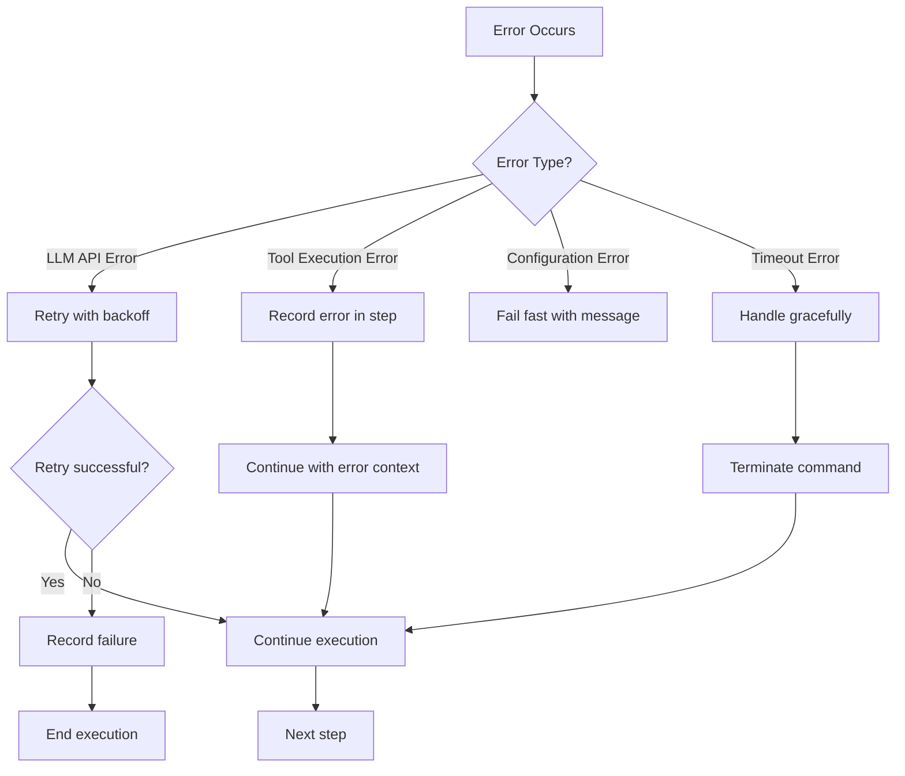

This architecture provides a robust, extensible foundation for autonomous agent operations with comprehensive monitoring, error handling, and visualization capabilities.